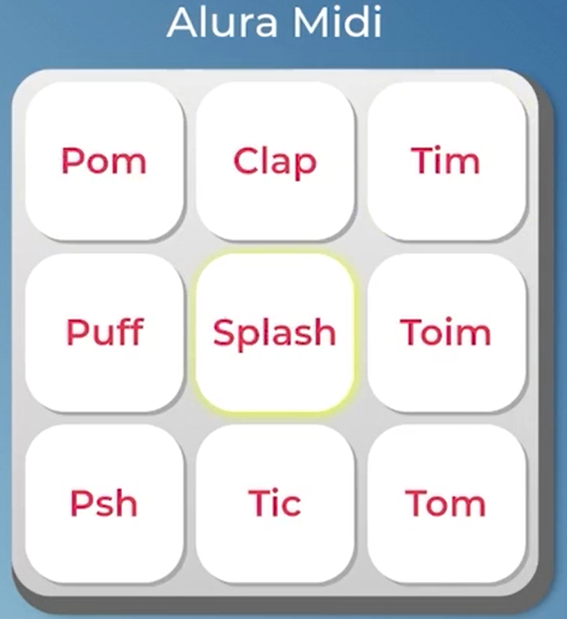

# Alura Midi

O **Alura Midi** é um instrumento musical digital desenvolvido para simular sons de diferentes instrumentos. Através de uma interface interativa, cada botão no painel reproduz o som correspondente a um instrumento musical. Este projeto oferece uma experiência imersiva para quem deseja explorar sons e criar músicas de forma simples e intuitiva.

## Imagem do Projeto



*Descrição da imagem do projeto.*

## Funcionalidades

- **Interface Interativa**: Botões representando diferentes instrumentos musicais, como piano, bateria, guitarra e outros.
- **Som de Alta Qualidade**: Sons de instrumentos reais, proporcionando uma experiência auditiva realista.
- **Fácil Navegação**: A interface é simples e acessível, permitindo que qualquer pessoa, mesmo sem experiência musical, possa brincar e criar música.

## Tecnologias Utilizadas

- **HTML5**: Estrutura da página.
- **CSS3**: Estilo e design da interface.
- **JavaScript**: Interatividade e controle dos sons dos instrumentos.
- **Web Audio API**: Manipulação e reprodução de áudio.

## Como Usar

1. Clone este repositório para o seu computador:
   ```bash
   git clone https://github.com/seu-usuario/alura-midi.git
